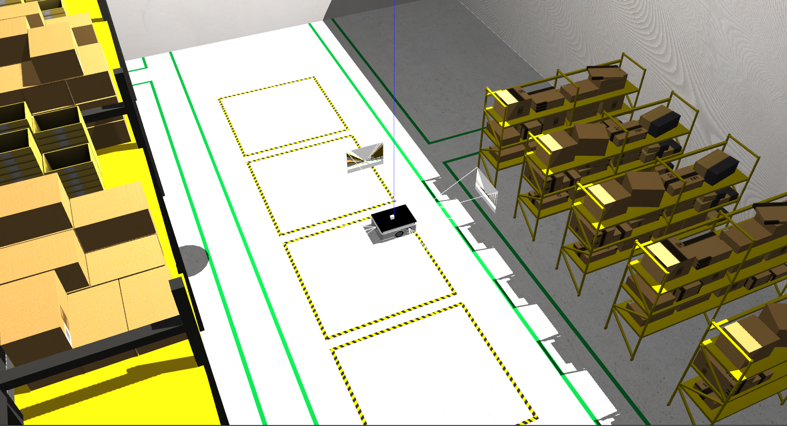
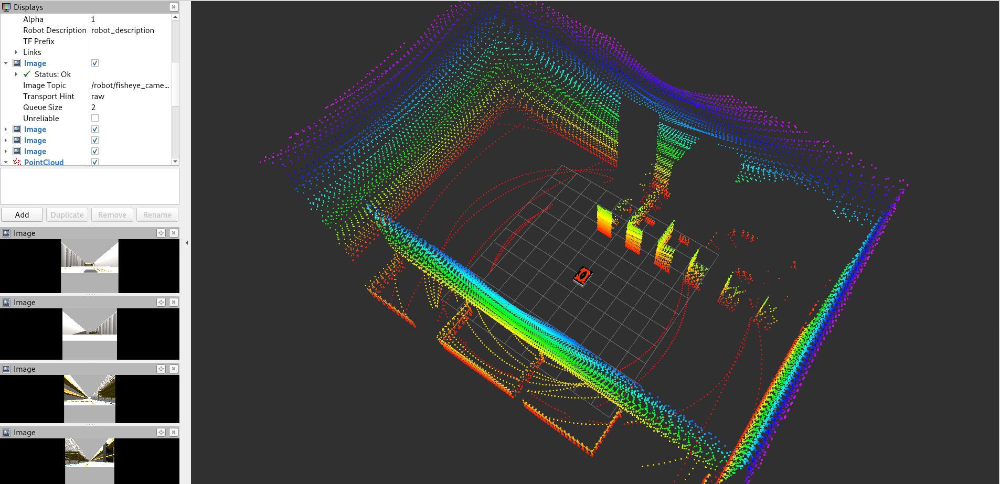

## About

This repository contains a Gazebo simulation for a differential drive robot, equipped with fisheye cameras and 3D LiDAR. 

## Noetic + Classic (Ubuntu 20.04)

### Dependencies

In addition to ROS1 Noetic and Gazebo Classic installations, the dependencies can be installed with [rosdep](http://wiki.ros.org/rosdep)

```bash
# From the root directory of the workspace. This will install everything mentioned in package.xml
rosdep install --from-paths src --ignore-src -r -y
```
Then clone the livox-related packages into the workspace:
```bash
git clone https://github.com/Livox-SDK/Livox-SDK.git
git clone https://github.com/Livox-SDK/livox_laser_simulation.git
git clone https://github.com/Livox-SDK/livox_ros_driver.git
```
Replace the `livox_points_plugin.cpp` in the `livox_laser_simulation/src` folder with the one in the `warehouse_simulation/resources` folder, then build them following the instructions of each repositories.

### Source Build

Download the codes into a ROS workspace, then
```bash
catkin build
```
### Run

To launch the robot in Gazebo,
```bash
roslaunch bcr_bot gazebo.launch
```
Make sure to `deactivate conda` before launching the robot!!!
```bash
conda deactivate
```
To view in rviz,
```bash
roslaunch bcr_bot rviz.launch
```

### Visualization
1. Gazebo:
	

2. Rviz:
	
	
### Configuration

The launch file accepts multiple launch arguments,
```bash
roslaunch bcr_bot gazebo.launch 
	camera_enabled:=True \
	position_x:=0.0 \
	position_y:=0.0 \
	orientation_yaw:=0.0 \
	odometry_source:=world \
	world_file:=small_warehouse.world \
	robot_namespace:="bcr_bot"
```

### Acknowledgements
- https://github.com/blackcoffeerobotics/bcr_bot.git
